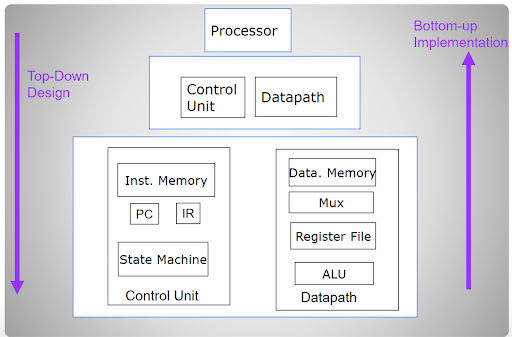
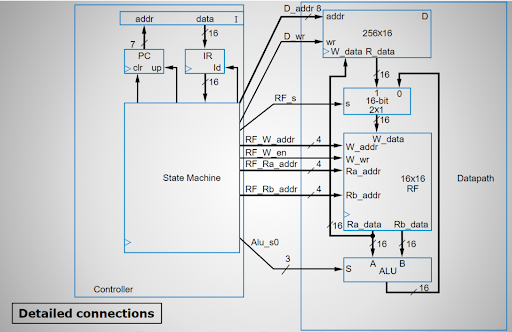

# SystemVerilog Processor

## Introduction
This is a simple 16-bit programmable processor project from our Digital Systems Design class. The processor’s architecture is based on Harvard Architecture where there are separate storages for instructions and data. This project demonstrates our skills and knowledge we gained in our computer engineering program so far, this includes SystemVerilog, RTL Design, Computer Architecture, Digital Circuit Testing, and more. 

## Design
The processor was designed through hierarchical design, each component was individually designed then tested and verified using ModelSim testbenches before assembling them into upper level processor modules. 

## Implementation

- **Controller unit** processes the instructions written in instruction memory and sends out control signals to the Datapath unit in accordance with the instruction being executed.
- **Instruction Memory (I)** holds our instructions. This is implemented as a memory initialization file called A.mif along with a 1-Port ROM Verilog file initialized from the Intel FPGA IP library on Quartus.
- **Instruction Register (IR)** is a group of flip-flops which latch out the next instruction to be executed. The load (ld) signal is set high when the state machine is ready for a new instruction.
- **Program counter (PC)** is a counter that tracks which instruction the processor is on. Set to 0 on initial startup and increments up when its up signal is set high by the State machine.
- **State machine** processes the 16-bit instructions from ROM and outputs control signals to the Datapath unit to execute the instructions. See Instruction Set section.
- **Datapath Unit** handles the execution of instructions. Data is moved between the Data memory and Registers. Data in the Registers can be operated on in the ALU unit and sent back to the Registers.
- **16-bit 2-1 Mux** allows the control unit select whether data from Data memory or the ALU unit is written to the Registers.
- **ALU** operates on sent register data and outputs back to the registers.
- **Register File (RF)** holds data that can be operated on by the ALU.
- **Data Memory (D)** holds non-volatile 16-bit data for our processor. This is implemented as a memory initialization file called D.mif along with a 1-Port RAM Verilog file initialized from the Intel FPGA IP library on Quartus.

## Instruction Set
- NOOP is no operation, processor does nothing for one cycle.
- STORE transfers data from data memory to registers.
- LOAD transfers data from registers to data memory.
- ADD adds the 16 bits of one register to another and stores the result in a register.
- SUB subtract the 16 bits of one register to another and stores the result in a register.
- HALT causes the processor to hard stop. Processor requires a reset to start again.
#### Table Key
- Rd = Destination Register Address (4 bits).
- Ra = Register A Address (4 bits).
- Rb = Register B Address (4 bits).
- Da = Data Address (8 bits).

|Instruction  | Bits 15 to 12 (Opcode) | Bits 11 to 8 | Bits 7 to 4 | Bits 3 to 0 |
|:------------|-----------------------:|:------------:|:-----------:|:------------|
|NOOP         |0000                    |xxxx          |xxxx         |xxxx         |
|STORE        |0001                    |Ra            |Da           |             |
|LOAD         |0010                    |Da            |             |Rd           |
|ADD          |0011                    |Ra            |Rb           |Rd           |
|SUB          |0100                    |Ra            |Rb           |Rd           |
|HALT         |0101                    |xxxx          |xxxx         |xxxx         |

### Running Simulations
ModelSim Testbenches can be run through executing the corresponding run{Component}.do files in each module directory. The project folder can be compiled on Quartus and then flashed onto an Altera DE2-115 board to test the processor.

### Specifications
- 128 x 16 Instruction Memory or ‘ROM’.
- 256 x 16 Data Memory or ‘RAM’.
- 16 x 16 Register file with 16 general purpose registers
- 50 Mhz clock.

### Hardware and Software Used
- Altera DE2-115 board 
- ModelSim 20.1.1
- Quartus Prime Lite 20.1.1
- Intel Cyclone IV device support 

